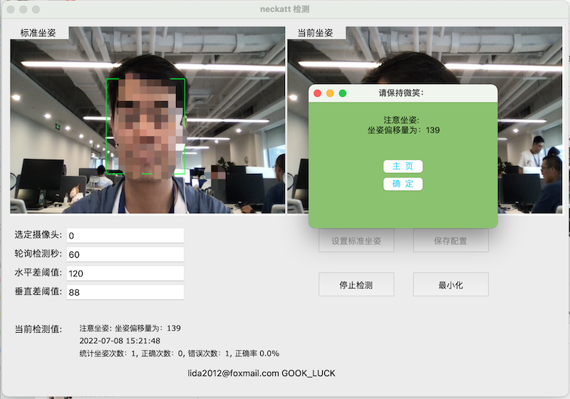
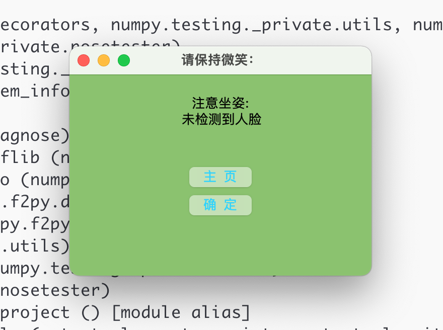

# pCare_neckAtt
程序员关爱-坐姿检测 颈部保护，通过mac的摄像头，间隔性检查坐姿是否标准，进而进行提醒

详细介绍文档： https://blog.csdn.net/htmljsp/article/details/125679729
mac app下载地址：https://download.csdn.net/download/htmljsp/85965939
window exe下载地址:https://download.csdn.net/download/htmljsp/86240352

免费获取请在 csdn 文章点赞 留言 邮箱地址

图片：

